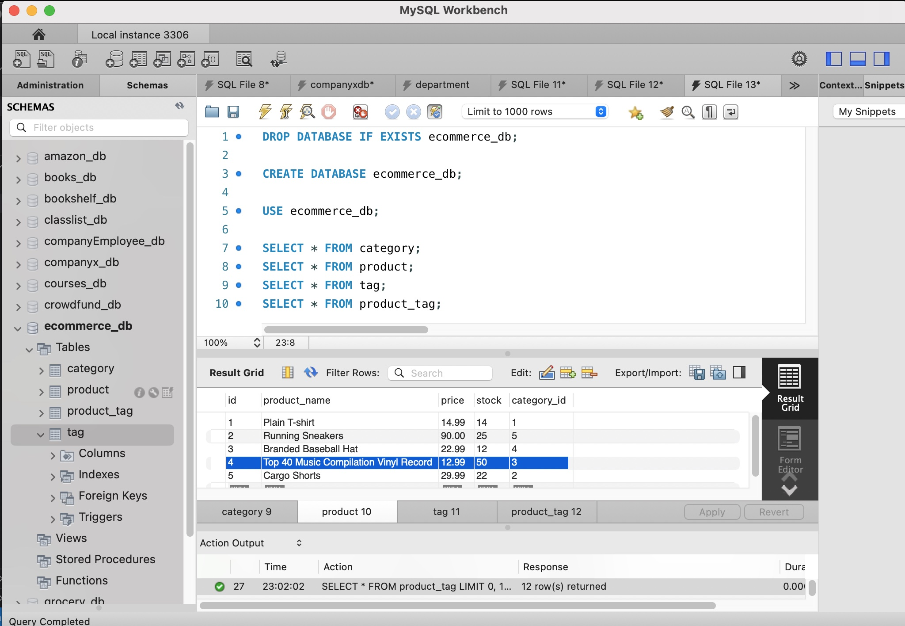

# E-commerce Back End

Link to video walk through: [https://drive.google.com/file/d/1G7d-f7vJ5HBsfscIzgwTRNbndIK7o4Qd/view](https://drive.google.com/file/d/1G7d-f7vJ5HBsfscIzgwTRNbndIK7o4Qd/view)

## Description

This is a build for the back end of an e-commerce site. Purpose of this build is to help developers understand the fundamaental architecure of e-commerce sites.

## Installation

An existing Express.js API was configured to use Sequelize to interact wiht MySQL database. Insomnia was used for testing CRUD operations.

## Preview & Usage

1. Install any necessary dependencies, npm run seed and npm run start.
2. Open MySQL workbench to check the database is created as per schema file and seeded.
3. Open Insomnia to test routes for categories, products and tags.

Click [here](https://drive.google.com/file/d/1G7d-f7vJ5HBsfscIzgwTRNbndIK7o4Qd/view) to watch a video walk-through.

Some additonal visual examples below.

## License

There were no licenses obtained for this project. For more information on licenses, follow this link:
[https://choosealicense.com/](https://choosealicense.com/).
